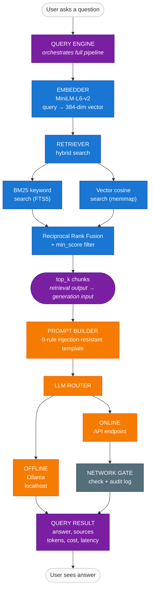
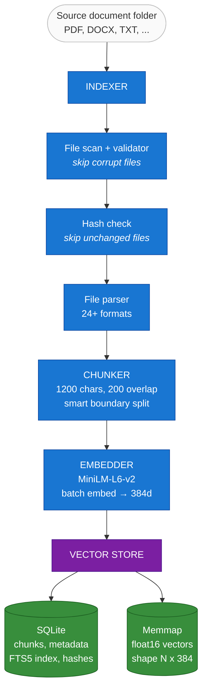
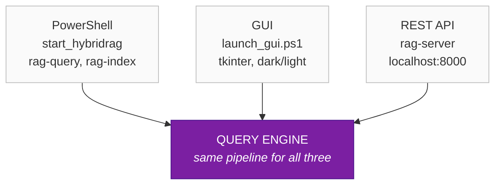

# HybridRAG3 -- System Architecture

> Block diagrams showing data flow through the system.
> All diagrams read top to bottom.
>
> **Color key (Query and Indexing diagrams):**
> - Blue = **Retrieval** (finding relevant information)
> - Orange = **AI Generation** (creating the answer)
> - Purple = **Handoff** (where retrieval output meets generation input)
> - Gray = **Infrastructure** (security, routing)

---

## Boot Sequence (runs once at startup)

```
              +-------------------+
              |       BOOT        |
              |     pipeline      |
              +-------------------+
                       |
                       v
              +-------------------+
              |  1. Load config   |
              |     (YAML)        |
              +-------------------+
                       |
                       v
              +-------------------+
              |  2. Resolve       |
              |     credentials   |
              |     (keyring/env) |
              +-------------------+
                       |
                       v
              +-------------------+
              |  3. Configure     |
              |     network gate  |
              |     (set mode)    |
              +-------------------+
                       |
                       v
              +-------------------+
              |  4. Probe         |
              |     backends      |
              |     (Ollama+API)  |
              +-------------------+
                       |
                       v
              +-------------------+
              |    BOOT RESULT    |
              |   success flag    |
              |   api_client      |
              |   warnings[]      |
              +-------------------+
                       |
                       v
             System ready for use
```

---

## Query Path (user asks a question)



---

## Indexing Path (building the search index)



> The entire indexing pipeline is **retrieval-side** (blue) -- it builds
> the search index that the query path reads from. The green database
> icons at the bottom are the **shared storage** that connects the two paths.

---

## Storage Layer

```
     <indexed data directory>/
            |
            +-- hybridrag.sqlite3       SQLite: chunks, metadata, FTS5, file hashes
            |
            +-- embeddings.f16.dat      Memmap: float16 vectors, shape [N, 384]
            |
            +-- embeddings_meta.json    Bookkeeping: dim, count, dtype
```

---

## Security Layers

```
     +----------------------------------------------------+
     |                 NETWORK GATE                        |
     |                                                    |
     |   OFFLINE    localhost:11434 (Ollama) only          |
     |   ONLINE     localhost + approved API endpoint      |
     +----------------------------------------------------+
                          |
                          v
     +----------------------------------------------------+
     |              CREDENTIAL MANAGER                     |
     |                                                    |
     |   1st  Windows Credential Manager (DPAPI)          |
     |   2nd  Environment variables                        |
     |   3rd  Config file (not recommended)                |
     +----------------------------------------------------+
                          |
                          v
     +----------------------------------------------------+
     |              EMBEDDING LOCKDOWN                     |
     |                                                    |
     |   HF_HUB_OFFLINE=1 enforced at startup             |
     |   Model loaded from local cache only                |
     +----------------------------------------------------+
```

---

## User Interfaces



---

## Color Legend

| Color | Meaning | Examples |
|-------|---------|---------|
| Blue | **Retrieval** -- finding relevant information | Embedder, Retriever, BM25, Vector search, RRF |
| Orange | **Generation** -- AI creates the answer | Prompt Builder, LLM Router, Ollama, API call |
| Purple | **Handoff** -- retrieval meets generation | Query Engine, top_k chunks, Query Result |
| Green | **Storage** -- persistent data | SQLite, Memmap files |
| Gray | **Infrastructure** -- security and routing | Network Gate |
