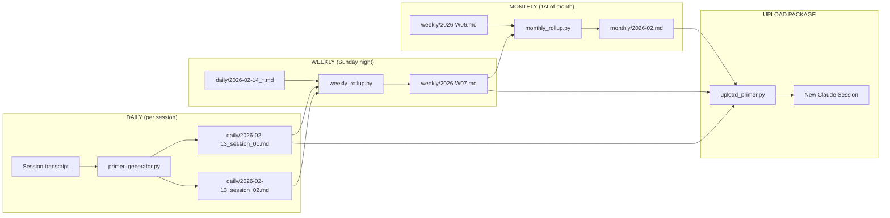

# Tiered Memory System -- Design Document

**Version:** 1.0.0
**Author:** the developer (RF/AI Engineer) + Claude
**Date:** 2026-02-13
**Status:** Design complete, implementation Sprint 3+

## Problem

A single primer from a single session captures one conversation. After 30 sessions, you have 30 separate primers. Uploading all 30 to a new Claude session would blow the context window (~150KB total vs ~200K token limit). You need a compression hierarchy that rolls daily knowledge into weekly summaries, and weekly into monthly -- so the upload is always a fixed, manageable size regardless of how many sessions you've had.

## Design: Three-Tier Rollup

```
Tier 1: DAILY primers     (one per session, ~2-5KB each, full detail)
   |
   v  weekly_rollup.py (every Sunday night)
Tier 2: WEEKLY primers    (one per week, ~4-8KB, compressed)
   |
   v  monthly_rollup.py (1st of each month)
Tier 3: MONTHLY primers   (one per month, ~6-10KB, strategic)
```

### What Gets Uploaded to Claude

For any new session, the upload package is:

```
UPLOAD = latest_monthly.md      (~8KB,  persistent strategic context)
       + latest_weekly.md       (~6KB,  this week's work)
       + today_sessions/*.md    (~3-5KB each, today's raw primers)
       ------------------------------------------------
       TOTAL: ~20-25KB per upload  (~5,000-6,000 tokens)
```

This stays roughly constant whether you've had 10 sessions or 500.

## Data Flow



## File Naming Conventions

```
primers/
    daily/
        2026-02-13_session_01.md      # Daily: date + session number
        2026-02-13_session_02.md
        2026-02-14_session_01.md
    weekly/
        2026-W07.md                    # Weekly: ISO week number
        2026-W08.md
    monthly/
        2026-02.md                     # Monthly: year-month
        2026-03.md
    upload/
        UPLOAD_PACKAGE.md              # Assembled upload (latest of each tier)
    archive/
        2026-Q1/                       # Quarterly archive of consumed dailies
```

**Naming rules:**
- Dates are always ISO 8601 (`YYYY-MM-DD`)
- Week numbers are ISO weeks (`W01`-`W53`)
- Session numbers are zero-padded two digits (`_session_01`)
- No spaces, no special characters, no Unicode

## Size Budgets

| Tier | Per-file Target | Max Allowed | Token Estimate | Retention |
|---|---|---|---|---|
| Daily | 2-5 KB | 8 KB | 500-1,250 tokens | 30 days, then archived |
| Weekly | 4-8 KB | 12 KB | 1,000-2,000 tokens | 12 weeks, then archived |
| Monthly | 6-10 KB | 15 KB | 1,500-2,500 tokens | Permanent |
| Upload package | 20-25 KB | 35 KB | 5,000-8,750 tokens | Regenerated each session |

**Budget enforcement:** If a rollup exceeds max, the rollup script re-runs with a tighter compression prompt (adds "compress to under X tokens" instruction). Two retries before flagging for manual review.

## Rollup Logic

### Daily --> Weekly (weekly_rollup.py)

**Trigger:** Sunday night at 10 PM (after nightly_run.py), or manually.

**Input:** All daily primers from the past 7 days.

**Process:**
1. Concatenate all daily primers for the week
2. Send to Ollama with `weekly_rollup_prompt.yaml`
3. Prompt instructs: merge duplicate topics, preserve decisions and their rationale, keep code references but drop implementation details, compress timeline into summary, retain all bug reports and their resolution status
4. Output: single `weekly/YYYY-WNN.md`

**What survives weekly compression:**
- Decisions made and why
- Bugs found and their fix status
- Architecture changes
- Sprint progress deltas
- Key code patterns learned
- Blockers and their resolution

**What gets dropped:**
- Debugging play-by-play (kept in daily archive)
- Repeated context-setting between sessions
- Installation/setup steps already completed
- Exploratory tangents that led nowhere

### Weekly --> Monthly (monthly_rollup.py)

**Trigger:** 1st of each month at 10 PM, or manually.

**Input:** All weekly primers from the past month (4-5 weeklies).

**Process:**
1. Concatenate all weekly primers for the month
2. Send to Ollama with `monthly_rollup_prompt.yaml`
3. Prompt instructs: extract strategic themes, major milestones, capability changes, project trajectory, skill growth, unresolved issues carried forward
4. Output: single `monthly/YYYY-MM.md`

**What survives monthly compression:**
- Project milestones achieved
- Major architecture decisions (still relevant)
- Skills acquired
- Persistent blockers
- Strategic direction changes
- Hardware/infrastructure changes

**What gets dropped:**
- Week-to-week debugging details
- Resolved bugs (unless pattern is instructive)
- Intermediate build steps
- Session-level metadata

## Upload Package Assembly (upload_primer.py)

```python
def assemble_upload():
    """
    Build the upload package for a new Claude session.

    STRATEGY:
    - Most recent monthly = long-term memory (who am I, what's the project)
    - Current week's weekly = medium-term memory (what happened this week)
    - Today's daily primers = short-term memory (what we just did)

    If no monthly exists yet (first month), use all available weeklies.
    If no weekly exists yet (first week), use all available dailies.
    """
    sections = []

    # --- LAYER 1: Strategic context (monthly) ---
    monthly = get_latest_file("primers/monthly/", "*.md")
    if monthly:
        sections.append(("## Long-Term Context", read_file(monthly)))

    # --- LAYER 2: This week's work (weekly) ---
    weekly = get_latest_file("primers/weekly/", "*.md")
    if weekly:
        sections.append(("## This Week", read_file(weekly)))

    # --- LAYER 3: Today's sessions (daily) ---
    today = date.today().isoformat()
    dailies = glob(f"primers/daily/{today}_session_*.md")
    for d in sorted(dailies):
        sections.append((f"## Session {extract_session_num(d)}", read_file(d)))

    # --- ASSEMBLE ---
    package = "# Knowledge Primer -- Upload Package\n\n"
    package += f"Generated: {datetime.now().isoformat()}\n\n"
    for header, content in sections:
        package += f"{header}\n\n{content}\n\n---\n\n"

    # --- SIZE CHECK ---
    token_est = len(package) // 4
    if token_est > 8750:  # 35KB / 4
        log_warning(f"Upload package {token_est} tokens, exceeds budget")

    write_file("primers/upload/UPLOAD_PACKAGE.md", package)
    return package
```

## Python Class Structure

### PrimerTier (enum)

```python
from enum import Enum

class PrimerTier(Enum):
    """
    Three tiers of knowledge compression.
    Each tier compresses the one below it on a schedule.
    """
    DAILY = "daily"      # Raw session primers, full detail
    WEEKLY = "weekly"    # 7-day rollup, decisions + progress
    MONTHLY = "monthly"  # 30-day rollup, strategic + milestones
```

### PrimerFile (dataclass)

```python
from dataclasses import dataclass
from datetime import date
from pathlib import Path

@dataclass
class PrimerFile:
    """
    Represents a single primer file at any tier.

    WHY a dataclass: immutable record of a primer's identity.
    The file content is read on demand, not stored in memory.
    """
    path: Path              # Full path to the .md file
    tier: PrimerTier        # Which compression tier
    date_created: date      # When this primer was generated
    source_count: int       # How many lower-tier files went into this
    size_bytes: int         # File size for budget enforcement
    token_estimate: int     # size_bytes // 4 (rough token count)

    @property
    def is_over_budget(self) -> bool:
        """Check if this primer exceeds its tier's max size."""
        max_sizes = {
            PrimerTier.DAILY: 8192,
            PrimerTier.WEEKLY: 12288,
            PrimerTier.MONTHLY: 15360,
        }
        return self.size_bytes > max_sizes[self.tier]
```

### RollupEngine

```python
class RollupEngine:
    """
    Compresses primers from one tier into the next tier up.

    DESIGN DECISIONS:
    - Uses Ollama (same openai SDK as primer_generator.py)
    - Each tier has its own YAML prompt with tier-specific instructions
    - Retries with tighter compression if output exceeds budget
    - Never deletes source files -- moves to archive after rollup

    WHY not just concatenate: Raw concatenation would grow linearly.
    LLM-powered rollup extracts signal and drops noise, keeping
    the upload package at ~20KB regardless of session count.
    """

    def __init__(self, config):
        self.config = config
        self.client = OpenAI(
            base_url=f"{config.OLLAMA_HOST}/v1",
            api_key="ollama"
        )
        # Load tier-specific compression prompts
        self.prompts = {
            PrimerTier.WEEKLY: load_yaml("prompts/weekly_rollup_prompt.yaml"),
            PrimerTier.MONTHLY: load_yaml("prompts/monthly_rollup_prompt.yaml"),
        }

    def rollup(self, source_tier: PrimerTier, target_tier: PrimerTier,
               source_files: list[PrimerFile]) -> PrimerFile:
        """
        Compress multiple source-tier primers into one target-tier primer.

        PROCESS:
        1. Read and concatenate all source file contents
        2. Prepend the tier-specific compression prompt
        3. Send to Ollama
        4. Validate output size against budget
        5. Retry with tighter prompt if over budget (max 2 retries)
        6. Write output file with correct naming convention
        7. Archive source files (move, don't delete)

        RETURNS: PrimerFile for the newly created rollup
        RAISES: RollupError if still over budget after retries
        """
        combined = self._concatenate_sources(source_files)
        prompt = self.prompts[target_tier]

        for attempt in range(3):
            result = self._call_ollama(prompt, combined, attempt)
            output = PrimerFile(
                path=self._generate_path(target_tier),
                tier=target_tier,
                date_created=date.today(),
                source_count=len(source_files),
                size_bytes=len(result.encode("utf-8")),
                token_estimate=len(result) // 4,
            )
            if not output.is_over_budget:
                self._write_and_archive(result, output, source_files)
                return output
            # Tighten compression for retry
            prompt = self._add_compression_constraint(prompt, attempt)

        raise RollupError(
            f"Rollup to {target_tier.value} still over budget after 3 attempts. "
            f"Size: {output.size_bytes} bytes. Manual review needed."
        )

    def _call_ollama(self, prompt: dict, content: str, attempt: int) -> str:
        """Send rollup request to Ollama with timeout scaling."""
        timeout = self.config.OLLAMA_TIMEOUT * (1 + attempt * 0.5)
        response = self.client.chat.completions.create(
            model=self.config.OLLAMA_MODEL,
            messages=[
                {"role": "system", "content": prompt["system"]},
                {"role": "user", "content": content},
            ],
            timeout=timeout,
        )
        return response.choices[0].message.content

    def _concatenate_sources(self, files: list[PrimerFile]) -> str:
        """Read and join source files with separators."""
        parts = []
        for f in sorted(files, key=lambda x: x.date_created):
            content = f.path.read_text(encoding="utf-8")
            parts.append(f"--- SOURCE: {f.path.name} ---\n{content}")
        return "\n\n".join(parts)

    def _generate_path(self, tier: PrimerTier) -> Path:
        """Generate output filename using naming conventions."""
        today = date.today()
        base = Path(self.config.PRIMERS_DIR) / tier.value
        if tier == PrimerTier.WEEKLY:
            week_num = today.isocalendar()[1]
            return base / f"{today.year}-W{week_num:02d}.md"
        elif tier == PrimerTier.MONTHLY:
            return base / f"{today.year}-{today.month:02d}.md"
        raise ValueError(f"No path generation for tier: {tier}")

    def _add_compression_constraint(self, prompt: dict, attempt: int) -> dict:
        """Add progressively tighter compression instructions."""
        constraints = [
            "Keep output under 2000 tokens. Be more aggressive about dropping detail.",
            "CRITICAL: Output must be under 1500 tokens. Only strategic-level facts.",
        ]
        modified = prompt.copy()
        modified["system"] += f"\n\n{constraints[min(attempt, len(constraints)-1)]}"
        return modified

    def _write_and_archive(self, content: str, output: PrimerFile,
                            sources: list[PrimerFile]) -> None:
        """Write rollup file and move sources to archive."""
        output.path.parent.mkdir(parents=True, exist_ok=True)
        output.path.write_text(content, encoding="utf-8")
        # Archive sources (never delete)
        quarter = f"{date.today().year}-Q{(date.today().month - 1) // 3 + 1}"
        archive_dir = Path(self.config.PRIMERS_DIR) / "archive" / quarter
        archive_dir.mkdir(parents=True, exist_ok=True)
        for src in sources:
            src.path.rename(archive_dir / src.path.name)
```

### UploadAssembler

```python
class UploadAssembler:
    """
    Builds the upload package from the latest primer at each tier.

    INVARIANT: Upload package is always < 35KB (~8,750 tokens).
    This ensures it fits in Claude's context with room for the
    actual conversation.
    """

    MAX_UPLOAD_BYTES = 35840  # 35KB hard ceiling

    def __init__(self, config):
        self.config = config
        self.primers_dir = Path(config.PRIMERS_DIR)

    def assemble(self) -> str:
        """
        Build upload package from latest monthly + weekly + today's dailies.

        FALLBACK CHAIN:
        - No monthly yet? Use all available weeklies (max 4)
        - No weekly yet?  Use all available dailies (max 7)
        - No dailies yet? Return empty package with instruction to run primer_generator
        """
        sections = []

        # Layer 1: Long-term context
        monthly = self._latest("monthly")
        if monthly:
            sections.append(("Long-Term Context", monthly.read_text(encoding="utf-8")))
        else:
            # Fallback: up to 4 most recent weeklies
            for w in self._recent("weekly", 4):
                sections.append(("Weekly Context", w.read_text(encoding="utf-8")))

        # Layer 2: This week
        weekly = self._latest("weekly")
        if weekly and monthly:  # Only add if monthly already covers older weeks
            sections.append(("This Week", weekly.read_text(encoding="utf-8")))

        # Layer 3: Today's sessions
        today_str = date.today().isoformat()
        dailies = sorted(self.primers_dir.glob(f"daily/{today_str}_session_*.md"))
        for d in dailies:
            num = d.stem.split("_session_")[1]
            sections.append((f"Today Session {num}", d.read_text(encoding="utf-8")))

        if not sections:
            return "# No primers available\n\nRun primer_generator.py first.\n"

        # Assemble
        package = "# Knowledge Primer -- Upload Package\n\n"
        for header, content in sections:
            package += f"## {header}\n\n{content}\n\n---\n\n"

        # Budget check
        if len(package.encode("utf-8")) > self.MAX_UPLOAD_BYTES:
            package = self._emergency_trim(package)

        return package

    def _latest(self, tier: str) -> Path | None:
        """Get the most recent file in a tier directory."""
        files = sorted(self.primers_dir.glob(f"{tier}/*.md"))
        return files[-1] if files else None

    def _recent(self, tier: str, count: int) -> list[Path]:
        """Get N most recent files in a tier directory."""
        files = sorted(self.primers_dir.glob(f"{tier}/*.md"))
        return files[-count:]

    def _emergency_trim(self, package: str) -> str:
        """If over budget, truncate oldest daily sections first."""
        lines = package.split("\n")
        while len("\n".join(lines).encode("utf-8")) > self.MAX_UPLOAD_BYTES:
            # Find and remove the last "Today Session" section
            for i in range(len(lines) - 1, -1, -1):
                if lines[i].startswith("## Today Session"):
                    # Remove from this header to next header or end
                    end = i + 1
                    while end < len(lines) and not lines[end].startswith("## "):
                        end += 1
                    del lines[i:end]
                    break
            else:
                break  # No more daily sections to trim
        return "\n".join(lines)
```

## Scheduling

| Job | Trigger | Script | Runtime |
|---|---|---|---|
| Daily primer | After each `save_session.py` (event-driven) | `primer_generator.py` | ~5-15 min (laptop) |
| Weekly rollup | Sunday 10:15 PM (after nightly_run) | `weekly_rollup.py` | ~3-5 min |
| Monthly rollup | 1st of month, 10:30 PM | `monthly_rollup.py` | ~3-5 min |
| Upload assembly | Before each new Claude session | `upload_primer.py` | <1 sec (no LLM) |
| Archive cleanup | Monthly, after rollup | `archive_cleanup.py` | <1 sec |

## YAML Rollup Prompts (New)

Two new YAML files needed in `prompts/`:

### weekly_rollup_prompt.yaml

```yaml
system: |
  You are a knowledge compression engine. Your job is to merge multiple
  daily session primers into a single weekly summary.

  RULES:
  - Preserve ALL decisions and their rationale
  - Preserve ALL unresolved bugs/blockers with status
  - Merge duplicate topics (if same topic discussed across days, combine)
  - Keep architecture changes and why they were made
  - Keep sprint progress as delta (what changed this week)
  - Drop debugging play-by-play (daily archive has it)
  - Drop repeated context-setting between sessions
  - Drop completed setup steps
  - Drop exploratory tangents that led nowhere
  - Output must be under 2000 tokens
  - Use plain text, no markdown headers deeper than ##
  - No em-dashes, no smart quotes, no emojis
```

### monthly_rollup_prompt.yaml

```yaml
system: |
  You are a strategic knowledge compressor. Merge multiple weekly primers
  into a single monthly intelligence briefing.

  RULES:
  - Extract project milestones achieved this month
  - Preserve major architecture decisions still in effect
  - Note skills and tools learned
  - Track persistent blockers carried forward
  - Record strategic direction changes and why
  - Note hardware/infrastructure changes
  - Drop resolved bugs (unless the pattern is instructive)
  - Drop week-to-week debugging details
  - Drop intermediate build steps
  - Output must be under 2500 tokens
  - Structure: Milestones, Decisions, Skills, Blockers, Direction
  - No em-dashes, no smart quotes, no emojis
```

## Verification Criteria

1. **Size invariant:** Upload package stays under 35KB regardless of session count
2. **No data loss:** Daily primers are archived, never deleted
3. **Freshness:** Today's sessions always included in upload (no rollup delay)
4. **Graceful degradation:** System works with zero monthly, zero weekly -- just uses whatever tiers exist
5. **Idempotent:** Running rollup twice on same inputs produces same output (no duplication)
6. **Budget enforcement:** Over-budget rollups retry with compression, then flag for review

## Implementation Order

1. **Sprint 2:** Create `primers/daily/`, `primers/weekly/`, `primers/monthly/`, `primers/archive/` directories. Modify `primer_generator.py` to write to `daily/` instead of `output/`.
2. **Sprint 3:** Implement `weekly_rollup.py` and `monthly_rollup.py`. Add rollup prompts. Wire into `nightly_run.py`.
3. **Sprint 3:** Implement `upload_primer.py` (upload assembly). Add to MORNING_START.bat.
4. **Sprint 4:** Add budget enforcement, retry logic, archive cleanup. Add metrics (rollup compression ratio, time, token counts).
